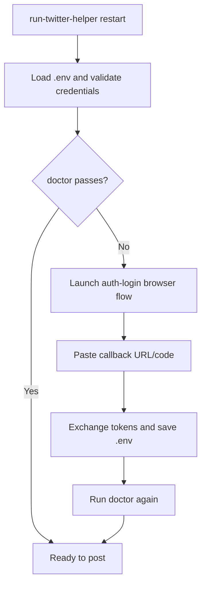

# Wizard Flow


```mermaid
flowchart TD
  A["run-twitter-helper restart"] --> B["Load .env and validate credentials"]
  B --> C{"doctor passes?"}
  C -- Yes --> D["Ready to post"]
  C -- No --> E["Launch auth-login browser flow"]
  E --> F["Paste callback URL/code"]
  F --> G["Exchange tokens and save .env"]
  G --> H["Run doctor again"]
  H --> D
```

Use this command to start recovery after reboot:

```bash
./run-twitter-helper restart
```
